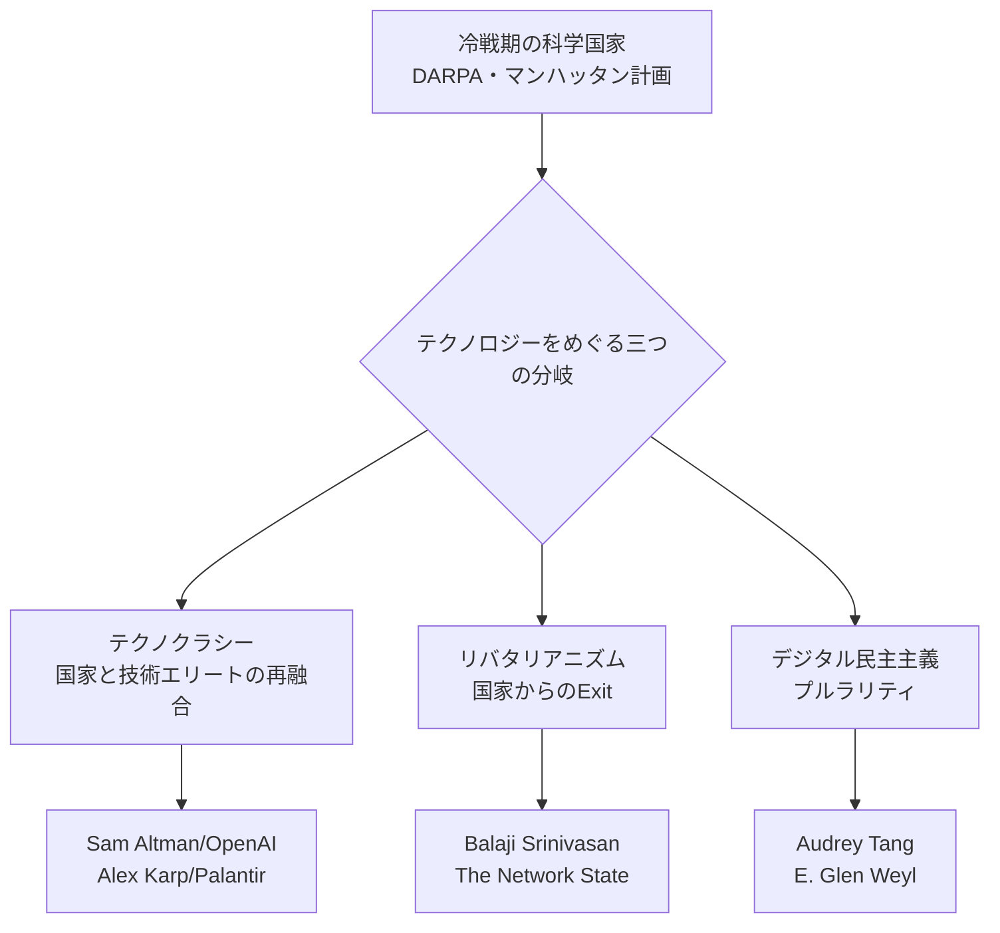

ここからは理系の方には毛嫌いされるかもしれないが、テクノロジーをめぐる思想や哲学の系譜の話をしたい。大学生に代表される最近の若者は思想や哲学を持つことひいては信念を持つことから意図的に逃避しているかもしれない。それは1960年代の全共闘への無意識の恐怖と失望があるのかもしれないし、失われた30年(35年とも言われるが)の中で政治・経済的変化が起こらなかったことの裏返しなのかもしれない。ただ、僕がこうしてこの文章を近年の若者批判から始めたのはその何も起こらなかったとされる「失われた」30年でWiiが生まれ、DSがあり、それが3DSになり、スマートフォンが出てきてIPadを持つ様になった、そのことの対照的なコントラストを強調したいからである。僕らは政治的、言論的な闘争よりも架空のアニメやゲーム、音楽、漫画に興奮している。近代におけるそのことの圧倒的な異常性は強調してもし足りないだろう。僕は歴史学者ではないが、昔(2000年代以前)は政治や哲学へのアタッチメントが教養なり美徳とされ、思想に影響を与えた人々を雄弁に讃えていた風潮は確かにあったのだ。例えば、『構造と力』でポスト構造主義、特にドゥルーズ・ガタリに代表されるtreeからリゾームへ、接続へ、逃走線を引くことなどをを強く推奨した哲学に関する言葉である「スキゾ/パラノ」は当時(1987年、バブルの時期である)の新語流行語大賞になっている。

そして日本の多くの哲学者・思想家・批評家はまだ僕らと同じ失われた30年の後半の20年を特に政治・経済的な変動のないその時期を、僕から言わせれば「快活に」過ごしたことをまだ誰も語ってくれない。その「快活さ」はネット（特にYoutube）の中で"発掘した"アーティストを"発掘したことそのもの"に、多くの親からは反対され、見たら頭が悪くなるとまで言われていた漫画やアニメ、ゲームで退屈を凌いだことに起因している。そして、近年、経済的に自立してきた我々の世代が織りなす推し活に代表されるファンダム経済はやっと注目される様になってきた。そして多くの哲学者、千葉雅也先生や谷川義弘先生はSNSやインターネット、スマートフォンがもたらした接続過剰（これはポスト構造主義に関わる単語である）の現状に深く影響されている。しかし、そこには大きく何かが深く欠けているように思う。それは、先ほども言った「快活さ」なのだと僕は思う。僕らはこれらの哲学者が多く語っているように本当にインターネットやSNS、スマホによって不幸になっているのか、僕ら（つまりz世代ということになるのだけど）の見せた時代への適応はおそらくまだ誰も批評してくれていない気がしている。

ここまで話してなんなのだけど、ここからの時代批評はこれから現れるz世代の僕ら同年代の批評家・思想家・哲学者に委ねる（きっとあと10年は現れないだろうが）として、これからは近年の「テクノロジー」をめぐる思想の系譜を示したい。

まず、近年のテクノロジーを代表するインターネット、ひいてはコンピュータを作ったのはジョン・フォン・ノイマン、アランチューリング、クロード・シャノンだろう。これは近年、落合陽一を代表されるメディアアーティストによって語られクリシェになってしまったので多くは語らない。

そして、そのコンピュータが、元々は軍事利用目的で開発が加速された科学技術の賜物が「大衆」（市民）に"偏在的に"分散されるだろうと予言したのは、ユビキタスコンピューティングを提唱したマークワイザーである。彼はIPadやLaptopのようなコンピュータを予言していたと言っても過言ではない。そして、テクノロジー史に欠かせないのがニコラス・ネグロポンテ、石井裕、伊藤穰一に代表されるMITメディアラボの方々で、HCI(Human Computer Interaction) を日本で牽引していた暦本純一だろう。暦本純一先生はマルチタッチデバイスの開発をされ、僕らが今使っているスマートフォンやiPadのピンチングのような技術を世界で初めて開発した人で、AndroidとAppleの訴訟にも一枚噛んでいる。これらもクリシェになるので多くを語ることは避ける・

これから語ることは、大きく三つの思想である。テクノロジーの加速主義「テクノクラシー」、web3などの技術を使って反国家を謳うリバタリアニズム、その二つの極とは違う第三の道である民主主義をテクノロジーの力によって改革するデジタル民主主義である。これはデジタル民主主義を提唱したAudrey tang氏の書かれた本である[Plurarity](https://github.com/pluralitybook/plurality)でCivilizationというゲームを用いて分類されている概念である。僕は近年のテクノロジーをめぐる思想はこの三つを知っておけば大方の説明はつくと思っている。

順番に見ていこう。まずはテクノクラシーからだ。

## テクノクラシー — Sam AltmanとAlex Karpが体現する「技術と国家の再融合」

2025年に出版され全米ベストセラーになった[『The Technological Republic』](https://techrepublicbook.com/)は、この文脈で避けて通れない一冊だ。著者はPalantir Technologiesの共同創業者でCEOのアレックス・カープと、同社の広報責任者ニコラス・ザミスカ。カープはハーバフォード大学からスタンフォード・ロースクールを経て、フランクフルトのゲーテ大学で社会理論の博士号を取っているという経歴の持ち主で、フランクフルト学派やハーバーマスの影響を公言している人物でもある（このあたり、僕がさっき名前を出したドゥルーズ・ガタリ的な文脈とはまったく逆の、理性と国家の再建を志向する保守的な社会理論の系譜だ）。

彼らの主張は明快で、シリコンバレーの最も優秀なエンジニアたちが広告最適化やフードデリバリーアプリのような「些末なもの」に才能を浪費し、国家的な目的意識を見失ったというものだ。かつてJ.C.R.リックライダーがDARPAの前身組織で「Man-Computer Symbiosis」を書き、空軍の支援を受けていたように、あるいはスプートニク・ショックの後にハンス・ベーテのような物理学者が政治指導者と密接に協働していたように、テクノロジーと国家は本来「re-unite」すべきだというのが彼らの結論であり、その象徴として彼らは新しい「マンハッタン計画」というレトリックを使う。ベンジャミン・フランクリンやトマス・ジェファーソンが同時に科学者であり政治家でもあったことを引き合いに出しながら、彼らはこれを「テクノロジカル・リパブリック」と呼んだ。

面白いのは、この本が理念の書であると同時に、2026年に入ってから現実がそれをほぼそのままなぞってしまったことだ。OpenAIのサム・アルトマンは2026年2月末、[国防総省の機密ネットワークでOpenAIのモデルを使用することを認める契約を発表した](https://techcrunch.com/2026/02/28/openais-sam-altman-announces-pentagon-deal-with-technical-safeguards/)。これはもともと2023年の時点では軍事利用を明確に禁止していたOpenAIのポリシーが、2024年以降段階的に緩和されていった末の到達点であり、「安全策は技術の側で担保する」というアルトマン自身の説明つきで発表された。ただしこの契約は、公開直後に社内外から強い反発を受け、アルトマン自身が「拙速で、体裁が悪かった」と認めて条件を再交渉するという一幕もあった。

この一件のもう一方の当事者として名前が挙がるのがAnthropicだ。Anthropicは自律型兵器システムへの組み込みと米国市民への大規模な国内監視について明確な一線を国防総省との交渉で求め、結果として合意には至らず「サプライチェーン上のリスク」に指定されるという展開になった。どちらの企業が正しいという話をしたいわけではなく（僕はこの手の判断をする資格を持ち合わせていない）、ただ、テクノロジーと国家権力の関係をどう設計するかという極めて具体的な選択が、2026年の現在、AI企業の間でリアルタイムに競われているという事実そのものが、カープの本が理念として語ったことの生々しい実演になっている、というのが僕の関心だ。

テクノクラシー、テクノロジカルリパブリックの概念を語る上で欠かせないのは、「国家とテクノロジーの癒合」特に産業の防衛技術への回帰を促している点だ。そこで代表的な企業が先ほどもあげたアレックスカープとピーターティールが立ち上げた「Palantir」とPalmer Luckeyが創業した「Anduril」である。この二社は近年、東アジアの軍事的圧力の緊張を持って日本にも急接近している。

## Web3とリバタリアニズム — 国家からの「離脱(exit)」を志向する人々

テクノクラシーが技術と国家の「融合」を目指すのだとすれば、その対極にあるのが技術による国家からの「離脱」、つまりリバタリアニズムだ。この系譜はサイファーパンクの「コードは法である」という発想にまで遡れるが、近年もっとも過激な結晶を見せたのが元CoinbaseのCTOでa16zのジェネラル・パートナーでもあったバラジ・スリニヴァサンが2022年に発表した[『The Network State』](https://thenetworkstate.com/)だ。

彼の議論はこうだ。既存の国民国家は「地理的には中央集権的だがイデオロギー的には分裂している」。そうではなく、まずインターネット上に強く結束したコミュニティ（Network Union）を作り、オンチェーンの国勢調査やDAOによる統治、暗号資産ウォレットによる経済的実在性の証明を積み重ねていけば、やがて世界中に分散した不動産クラスタが実際の外交承認を得る「Network State」に育つ、という三段階モデルである。実際に彼のダッシュボード上には、パナマの都市開発プロジェクトから車のない街を作るCuldesac、ヴァヌアツの暗号資産コミュニティSatoshi Islandまで、20を超える「スタートアップ・ソサエティ」が並んでいるらしい。2024年にはマレーシアで「Network School」という実験的な合宿まで開催されている。

ここで重要なのは、Web3コミュニティの内部でさえこの純粋なリバタリアニズムへの距離の取り方は一枚岩ではないということだ。イーサリアムの創始者ヴィタリック・ブテリンは、Web3の技術的自由と公共財・コモンズの問題を切り離せないと繰り返し主張しており、無政府資本主義的な方向にコミュニティ全体が流れることには距離を置いている。つまりリバタリアニズムを突き詰めた先で、結局「じゃあコモンズは誰が支えるのか」という問いに突き当たり、これが次の第三の道への橋渡しになる。

## Audrey Tangと「プルラリティ」— 第三の道としてのデジタル民主主義

そしてようやく本題、Audrey Tang(オードリー・タン)の話である。台湾初のデジタル担当大臣（2016〜2024年）にして世界初のノンバイナリーの閣僚。COVID-19の初期、マスクの在庫を全国民に公平に配布するシステムをわずか数日で構築したという逸話はもはや伝説的だが、その手法の背景にあるのが彼女が2014年頃から関わってきたg0v(ガブゼロ)というシビックハッカーのムーブメントと、市民参加型の政策討議プラットフォームvTaiwan、そして意見の合意形成を可視化するPolisというツール群だ。

2024年、彼女は経済学者のE・グレン・ワイル（マイクロソフト・リサーチ、『Radical Markets』著者）と100人を超えるオンラインの共著者たちとともに、[『PLURALITY』](https://plurality.net/ja/)という本をGitHub上でオープンに執筆し、CC0でパブリックドメインに捧げるという形で発表した。この本が明示的に述べているのが、まさに僕がここまで書いてきた三分法そのものだ。プルラリティはリバタリアニズム、テクノクラート的な統治、そして停滞した民主主義という三つの物語のどれとも違う代替案を志向する、と本文中で明言されている。つまりこの三分法は僕が勝手に考えた整理ではなく、当のプルラリティ論者たち自身が採用している対抗軸なのである。

タイトルの「Plurality(多元性)」は「Singularity(単一性)」との対比で選ばれた語で、対立や差異をコラボレーションの技術によって創造性に変換していくという思想を指す。日本語版は2025年にサイボウズ式ブックスから刊行され、トマ・ピケティ『21世紀の資本』の翻訳者として知られる山形浩生が訳を、『なめらかな社会とその敵』の鈴木健が解説を担当した。ダライ・ラマ14世、台湾前総統の蔡英文、そしてヴィタリック・ブテリンまでもが推薦の言葉を寄せている。日本でも「デジタル民主主義2030」というプロジェクトを通じてvTaiwan/Polis的な手法が輸入され、チームみらいが国政選挙で議席を得て安野貴博氏が参議院議員になるという形で、既に実装が始まっている。

### ここまでの整理

{/* Astro側にmermaid用のremarkプラグインが入っていなければ、下のコードブロックは図版画像に差し替えてください */}

| 観点 | テクノクラシー | Web3リバタリアニズム | デジタル民主主義（プルラリティ） |
|---|---|---|---|
| 国家との関係 | 国家と技術エリートの再融合 | 国家からの離脱（Exit） | 国家と市民社会の協働（Voice） |
| 鍵となる技術 | 軍事AI・防衛インフラ | DAO・パーミッションレスな暗号資産 | vTaiwan・Polis・二次の投票 |
| 象徴的人物 | Alex Karp／Sam Altman | Balaji Srinivasan | Audrey Tang／E. Glen Weyl |
| 象徴的テキスト | 『The Technological Republic』 | 『The Network State』 | 『PLURALITY』 |
| キーフレーズ | 新しいマンハッタン計画 | Exit over Voice | 多元性（Plurality） |

## 理論から実装へ — Ethereum、マイナウォレット、JPYC、DeSci

ここまでは思想の話をしてきたが、2026年の日本ではこの三分法が驚くほど具体的なインフラとして実装され始めている。プルラリティの推薦者にヴィタリック・ブテリンの名前があったことを思い出してほしい。Ethereumはスマートコントラクトとパーミッションレスな協調を可能にする基盤技術として、この三つの思想すべてに（リバタリアニズム的にもデジタル民主主義的にも）通底している。ブテリン自身が近年提唱している「d/acc（防御的・分散的加速主義）」という概念も、加速主義とセーフティを両立させようとする一種の統合の試みだと僕は理解している。

その上で日本固有の動きとして面白いのが[JPYC](https://jpyc.co.jp/)だ。2025年10月に発行が始まった円建てステーブルコインで、2025年内に法的な区分を「前払式支払手段」から「電子決済手段」へと移行させ、規制上の正統性を得た。LINEヤフー系のLINE NEXTが展開するWeb3ウォレット「Unifi」への採用（LINEの9500万人以上のユーザー基盤へのリーチ）、ソニー銀行とのMOU締結、企業の基幹システムとノーコードで連携できる「JPYCアダプター」をアステリアと共同開発するなど、2026年に入ってから提携が加速している。お好み焼きの千房や有楽町の家電量販店、京都のチェリオ自動販売機など実店舗決済の実証実験も広がっており、累計発行額は2026年4月時点で21億円を突破、直近3か月で約2.6倍というペースで伸びている。

さらに象徴的なのが[マイナウォレット](https://www.mynawallet.jp/)だ。これはマイナンバーカード（2026年時点で保有率81%超）を、公的個人認証（JPKI）を組み込むことでそのままWeb3ウォレットとして機能させようという構想で、「誰一人取り残すことなく、デジタル資産を活用できる世界を」というミッションを掲げている。秘密鍵やパスワードの管理という、Web3の民主化を阻んできた最大の技術的障壁を、国家が発行する身分証というレイヤーで解決しようとしているわけだ。三井住友カードの決済端末「stera」を使ったステーブルコイン・タッチ決済の実証実験（福岡のプロバスケットボールの試合会場で実施）や、デジタルガレージ・JCB・りそなホールディングスと組んだ渋谷のカフェでのQRコード決済実験など、2026年に入って急速に社会実装フェーズへ移行している。

これは僕にとってかなり示唆的な事例だ。マイナウォレットは、国家のIDインフラ（テクノクラシー的な要素）を土台にしながら、Web3の技術（本来はリバタリアニズム的な、国家からの離脱を志向する技術）を、誰も取り残さないという包摂的な理念（プルラリティ的な要素）のために使っている。つまりこれは三つの思想のどれか一つに綺麗に分類できるものではなく、国家がWeb3のエートスを回収してしまった事例と見ることもできるし、逆にプルラリティが目指していた「国家と市民社会の協働」の一つの正当な実装と見ることもできる。この評価はまだ定まっていないと僕は思うし、むしろここに評価を下さないまま宙吊りにしておくことこそが、今この現象を語る上で誠実な態度なのかもしれない。

最後にDeSci（分散型科学）についても触れておきたい。これはブロックチェーンとDAOを使って研究資金の調達・データ共有・査読を脱中央集権化しようという運動で、[Ethereum財団自身が公式ページを持っている](https://ethereum.org/ja/desci/)ことからもわかるように、Web3の中でもかなり本気度の高い領域だ。老化研究に資金を出すVitaDAO、女性の健康問題に取り組むAthenaDAO、合成生物学のValleyDAO、そして研究者が直接資金調達できるプラットフォームResearchHub（Coinbase創業者のブライアン・アームストロングが自身の持ち株の2%を売却して資金提供したことでも知られる）など、具体的なプロジェクト群がすでに稼働している。ヴィタリック・ブテリンが老化研究者オーブリー・デ・グレイと対談を重ねているのも、偶然ではないはずだ。

## 結語 — 「軍事」だけでいいのか

さて、ここで最初に戻りたい。カープとザミスカの『テクノロジカル・リパブリック』が最終的に呼びかけるのは、AIをめぐる「新しいマンハッタン計画」であり、その射程はほとんど軍事・防衛に限定されている。彼らの本の中で繰り返し参照されるのも、DARPAであり、原爆であり、月面着陸であり、要するに20世紀の国家的プロジェクトはことごとく軍事か、軍事と地続きの宇宙開発だ。

しかし僕はこの狭さにこそ違和感を覚える。彼らの本当の主張——優秀なエンジニアの才能を、市場が勝手には配分しない「本当に困難な問題」に振り向けるべきだ、という主張——を素直に受け取るなら、その「困難な問題」は軍事だけであるはずがない。老化、疾病、気候変動、エネルギー。これらは国家安全保障と同じくらい、いやもしかしたらそれ以上に、人類にとって不可逆的で切実な「ハードプロブレム」のはずだ。そして面白いことに、DeSciの領域ではまさにこれと同じ野心が、国家や軍需産業を介さずに、Web3的なボトムアップの形ですでに動き出している。VitaDAOやAthenaDAOがやろうとしていることは、カープがシリコンバレーの防衛産業に求めていることの、老化研究・女性の健康というドメインにおける先行実装なのだ。

思えばプルラリティの目次自体、権利や投票と並んで「保健」という章を独立して立てている。オードリー・タンとE・グレン・ワイルは、テクノロジーと国家（あるいは市民社会）の協働先を政治的な意思決定に限定せず、最初から医療や環境を射程に含めていた。カープの本には欠けていて、プルラリティにはすでにあったもの——それがこの「軍事に限定しない」という視点なのだと僕は思う。テクノロジカル・リパブリックというコンセプトを本当に真剣に受け取るなら、その「リパブリック」が守るべき対象は国境線だけでなく、僕らの老いていく身体、疲弊していく環境そのものでもあるはずだ。

それはWiiやDS、iPadに興奮していた僕らの世代が、次はVitaDAOやマイナウォレットに、それと知らずに巻き込まれていく番だということでもある。

---

**参考リンク**
- Alexander C. Karp, Nicholas W. Zamiska, *The Technological Republic* 公式サイト: https://techrepublicbook.com/
- OpenAIの国防総省契約について（TechCrunch）: https://techcrunch.com/2026/02/28/openais-sam-altman-announces-pentagon-deal-with-technical-safeguards/
- 契約再交渉について（Fortune）: https://fortune.com/2026/03/03/sam-altman-openai-pentagon-renegotiating-deal-anthropic/
- Balaji Srinivasan, *The Network State* 公式サイト: https://thenetworkstate.com/
- Audrey Tang, E. Glen Weyl, *PLURALITY* 日本語版: https://plurality.net/ja/
- JPYC株式会社: https://jpyc.co.jp/
- マイナウォレット株式会社: https://www.mynawallet.jp/
- Ethereum財団によるDeSci解説: https://ethereum.org/ja/desci/
